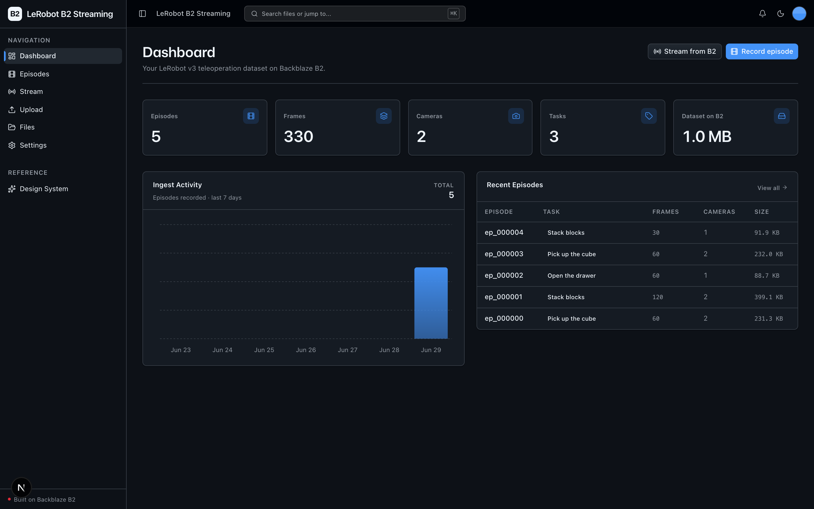
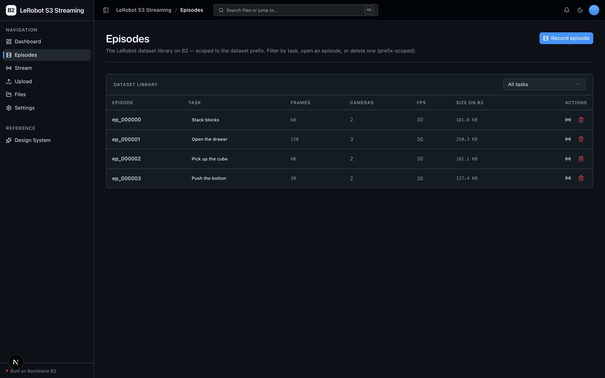
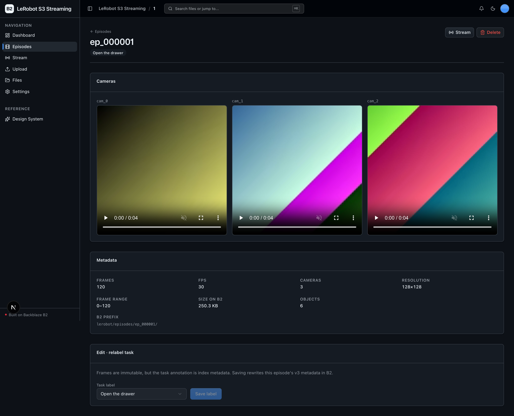
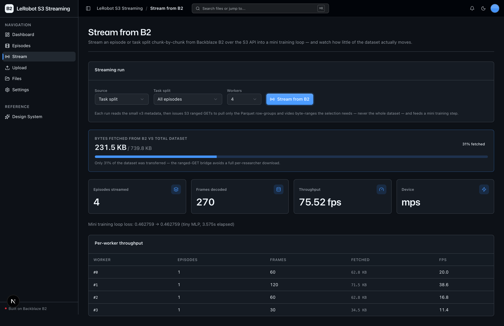

<!-- last_verified: 2026-06-30 -->
# LeRobot B2 Streaming

**Stream HuggingFace LeRobot v3 robot datasets straight from a Backblaze B2 bucket over the S3 API — train without downloading the whole dataset.**

Use a single **[Backblaze B2](https://www.backblaze.com/sign-up/ai-cloud-storage?utm_source=github&utm_medium=referral&utm_campaign=ai_artifacts&utm_content=b2ai-lerobot-b2-streaming)** bucket as the shared dataset backend for [HuggingFace LeRobot](https://github.com/huggingface/lerobot). Record teleoperation **episodes** (multi-camera MP4 + a Parquet state/action table, in the real **LeRobotDataset v3** layout) built from **real robot camera footage**, persist them to B2, index them by task label, and then **stream them back chunk-by-chunk from B2 over the S3 API** to feed training — with no per-researcher full-dataset download.

The camera frames are genuine teleoperation footage. The **source dataset is selectable in the record form** — a curated dropdown of vetted public LeRobot v3 datasets, plus a **"Custom repo…"** option to point ingest at *your own* public HuggingFace `owner/name`. The default is the small public **[`lerobot/svla_so101_pickplace`](https://huggingface.co/datasets/lerobot/svla_so101_pickplace)** dataset (a real SO-101 arm). Whichever source you pick, only its first one or two episodes are pulled and cached on demand via the LeRobot SDK's partial-download path — never the whole set. A custom source that can't load (private, gated, or not v3) reports a clear error rather than silently substituting frames. (A procedural-gradient generator remains only as a logged offline fallback **for the default source** so the interactive demo never crashes when the Hub is unreachable.)

Built for ML / robotics engineers who already know LeRobot and want object storage instead of a local disk or the HuggingFace Hub. The entire ML workload runs **locally** (CPU by default, GPU auto-detected) — your only credentials are B2.

## What it looks like

**Dashboard** — dataset-on-B2 metrics (episodes, frames, cameras, tasks, total size), a 7-day ingest-activity chart, and a recent-episodes table.



**Episodes** — the sample-scoped dataset library on B2, with per-episode frames, cameras, fps, and size, a task filter, and stream/delete actions.



**Episode detail** — per-camera MP4 playback, the v3 metadata (frame range, resolution, object count, B2 prefix), and inline task relabeling.



**Stream from B2** — the marquee ranged-GET bridge: stream a task split across N workers and watch bytes-fetched-vs-total, throughput, and per-worker stats.



## Does LeRobot stream from S3 / B2? (the honest framing — fills LeRobot#764)

LeRobot's `StreamingLeRobotDataset` is **HuggingFace-Hub-only**. It takes a `repo_id` and streams from the Hub; it has **no** native support for S3, a custom endpoint, fsspec, or even an arbitrary local `root` — non-Hub roots are an open feature request, [huggingface/lerobot#764](https://github.com/huggingface/lerobot/issues/764). So "point `StreamingLeRobotDataset` at B2" is **not** something stock LeRobot can do, and this sample does **not** pretend otherwise.

Instead this sample provides the **B2/S3 streaming bridge** the v3 format was explicitly designed for. The v3 layout records per-episode byte/frame offsets into shared shards, so the bridge:

1. reads the small v3 metadata (`meta/info.json`, `meta/episodes/*.parquet`) from B2, then
2. issues S3 **ranged GETs** (`get_object(Range=…)`) to pull only the Parquet row-groups and the specific video byte-ranges for the requested episodes — never the whole dataset.

The measurable, verifiable invariant: **bytes fetched from B2 ≪ total dataset size.** In a typical run the streamer decodes every frame while fetching only a fraction of the episode's bytes. This bridge is essentially what LeRobot#764 is asking for.

## What you get

- **Record an episode** with the genuine LeRobot v3 API (`LeRobotDataset.create() → add_frame → save_episode → finalize`) — real multi-camera robot footage from a **selectable** public v3 dataset (a curated list, or your own via "Custom repo…"; default `lerobot/svla_so101_pickplace`) + its real state/action table, encoded to MP4 and uploaded to B2. The recording **mirrors the source's real shape** (its cameras, fps, native resolution, state/action dims, and episode length) — you pick the source, not a synthetic frame count or resolution. The form previews exactly what will be recorded before you submit.
- **Browse the dataset** in a sample-scoped `/episodes` explorer (filter by task) plus per-camera MP4 playback, state/action metadata, and B2 keys on each detail page.
- **Stream from B2** at `/stream`: pick an episode or a task split, stream it chunk-by-chunk into a mini training loop, and watch bytes-fetched-via-Range vs total dataset size — with an N-worker concurrent mode for the shared-backend / fleet story.
- **Full bucket explorer** (`/files`) and **upload** (`/upload`) retained from the starter kit, so the bucket stays fully inspectable.

## Architecture at a glance

- **Frontend** — Next.js 16 + React 19 + Tailwind v4 + shadcn/ui, TanStack Query data layer.
- **Backend** — FastAPI with strict layering (`types → config → repo → service → runtime`), structural tests, `/health`, `/metrics`, JSON logging.
- **B2 surface** — S3-compatible API only (boto3), one client in `repo/`, custom user agent `b2ai-lerobot-b2-streaming`. The ranged GETs are plain S3 `Range` requests, not the b2-native API.
- **LeRobot / torch** — contained in `services/api/app/repo/lerobot_dataset.py` (v3 build/read) and `repo/b2_stream.py` (the bridge).

See [ARCHITECTURE.md](ARCHITECTURE.md) for the v3 layout, B2 prefix layout, and the streaming data flow.

## Quick Start

You need: Node.js >= 20, pnpm >= 9, Python >= 3.11, and a free **[Backblaze B2 account](https://www.backblaze.com/sign-up/ai-cloud-storage?utm_source=github&utm_medium=referral&utm_campaign=ai_artifacts&utm_content=b2ai-lerobot-b2-streaming)**.

**1. Install frontend dependencies**

```bash
pnpm install
```

**2. Set up the backend (base + ML deps)**

The base API boots without torch; the **ingest and streaming features** need the ML deps in a separate file (kept out of the structural-test fast path):

```bash
cd services/api
python3 -m venv .venv && source .venv/bin/activate
pip install -r requirements.txt
pip install -r requirements-ml.txt      # lerobot, torch, torchcodec — see notes below
cd ../..
```

> **ML deps notes.** `lerobot` is pinned to a verified window (`>=0.4.4,<0.5`) that matches Python 3.11; `0.5.x` requires Python ≥3.12. Video encode/decode runs through **torchcodec / PyAV** (their bundled ffmpeg), **not** a bare system `ffmpeg` (Homebrew's is slim). CPU torch wheels are used by default; the device auto-detects **CUDA → Apple MPS → CPU** at runtime and defaults to CPU — no GPU is required.

**3. Add your B2 credentials**

```bash
cp .env.example .env
```

Open `.env`, then in the [Backblaze B2 dashboard](https://secure.backblaze.com/b2_buckets.htm?utm_source=github&utm_medium=referral&utm_campaign=ai_artifacts&utm_content=b2ai-lerobot-b2-streaming):

1. **Create a bucket** and paste:
   - **Bucket Unique Name** → `B2_BUCKET_NAME`
   - the bucket's **region** (e.g. `us-west-004`, from the S3 endpoint) → `B2_REGION` (the S3 endpoint URL is derived from it)
2. **Create an application key** with `Read and Write`:
   - **keyID** → `B2_APPLICATION_KEY_ID`
   - **applicationKey** → `B2_APPLICATION_KEY` *(shown once)*

`B2_PUBLIC_URL_BASE` is optional — leave it blank to play MP4s back via presigned URLs (the default).

**4. Run it**

```bash
pnpm dev
```

Frontend at `localhost:3000`, API at `localhost:8000`. Open **Episodes → Record episode**, keep the default **Source dataset** (or pick another curated v3 dataset, or your own via "Custom repo…"). The form previews the source's real shape; once it loads, hit **Record** and a v3 episode built from real robot footage — mirroring that source's cameras/fps/resolution — is uploaded to B2 in a few seconds (the first recording from a given source lazily downloads a couple of its episodes and caches them). Then open **Stream** to stream it back from B2 and watch the bytes-fetched-vs-total readout.

`pnpm dev` runs `pnpm doctor` first — a preflight check for Node/Python versions, the venv, and a valid `.env`.

## Core Features

- [Episode ingest → B2](docs/features/episode-ingest.md) — build a v3 episode from real robot footage and upload it to B2
- [Dataset index & query](docs/features/dataset-index-query.md) — list/filter episodes by task from v3 metadata on B2
- [B2 S3 chunk-by-chunk streaming](docs/features/b2-streaming.md) — the marquee ranged-GET bridge (fills LeRobot#764)
- [Episode library explorer](docs/features/episode-library.md) — the sample-scoped `/episodes` browser
- [Concurrent multi-worker streaming](docs/features/concurrent-streaming.md) — N workers, shared B2 backend
- [File Upload](docs/features/file-upload.md) / [File Browser](docs/features/file-browser.md) — the retained full-bucket surface
- [Dashboard](docs/features/dashboard.md) — episode/dataset metrics, ingest activity, recent episodes
- [Design System](docs/design-system.md) — tokens, primitives, error/empty states. Live preview at `/design`.

## Tech Stack

- TypeScript, Next.js 16, React 19, Tailwind v4, shadcn/ui, Recharts, TanStack Query
- Python 3.11+, FastAPI, boto3, Pydantic v2
- LeRobot v3 (`lerobot`), PyTorch, torchcodec / PyAV, pyarrow, Pillow
- Real-robot footage from the public [`lerobot/svla_so101_pickplace`](https://huggingface.co/datasets/lerobot/svla_so101_pickplace) dataset (`huggingface_hub`)
- Backblaze B2 (S3-compatible object storage)
- pnpm workspaces (monorepo)

## Commands

| Command | What it does |
|---------|-------------|
| `pnpm dev` | Start frontend + backend |
| `pnpm dev:web` | Frontend only |
| `pnpm dev:api` | Backend only |
| `pnpm build` | Build frontend |
| `pnpm lint` | Lint frontend |
| `pnpm lint:api` | Lint backend (ruff) |
| `pnpm test:api` | Run backend tests |
| `pnpm check:structure` | Verify layering rules |
| `pnpm test:e2e` | Playwright e2e tests (run `pnpm --filter @lerobot-b2-streaming/web exec playwright install chromium` once first) |

## Documentation Map

| Doc | Purpose |
|-----|---------|
| [AGENTS.md](AGENTS.md) | Agent table of contents — start here |
| [ARCHITECTURE.md](ARCHITECTURE.md) | System layout, v3 layout, B2 prefix layout, streaming data flow |
| [docs/features/](docs/features/) | Feature docs |
| [docs/app-workflows.md](docs/app-workflows.md) | User journeys |
| [docs/dev-workflows.md](docs/dev-workflows.md) | Engineering workflows and testing |
| [docs/SECURITY.md](docs/SECURITY.md) | Security principles |
| [docs/RELIABILITY.md](docs/RELIABILITY.md) | Reliability expectations |

## License

MIT License — see [LICENSE](LICENSE) for details.
